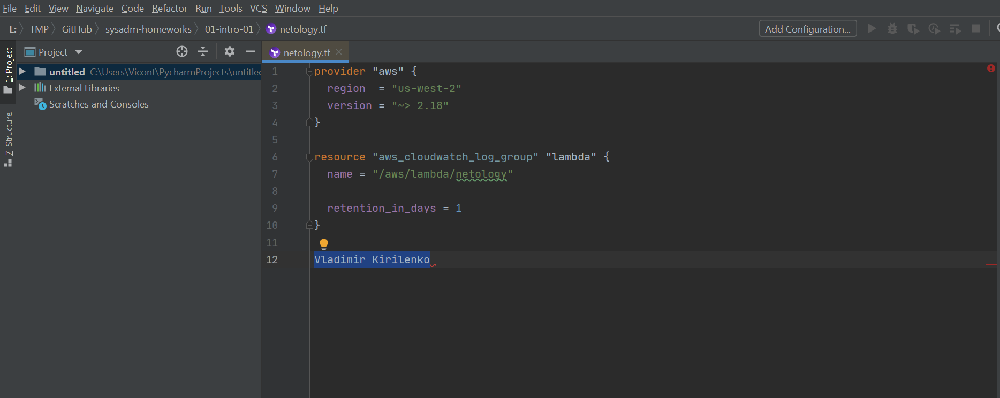
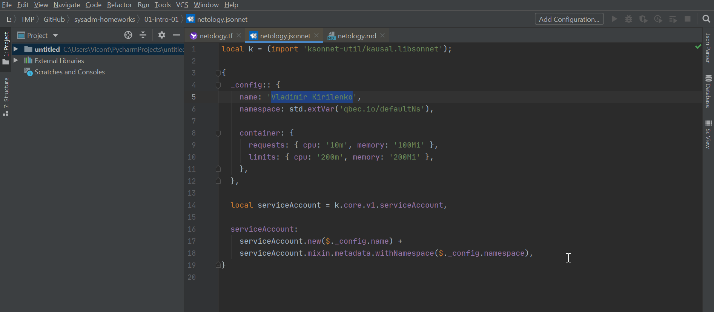
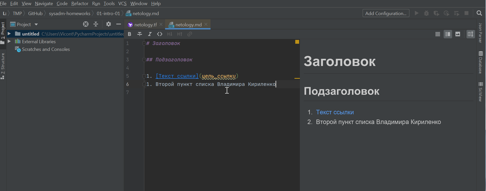
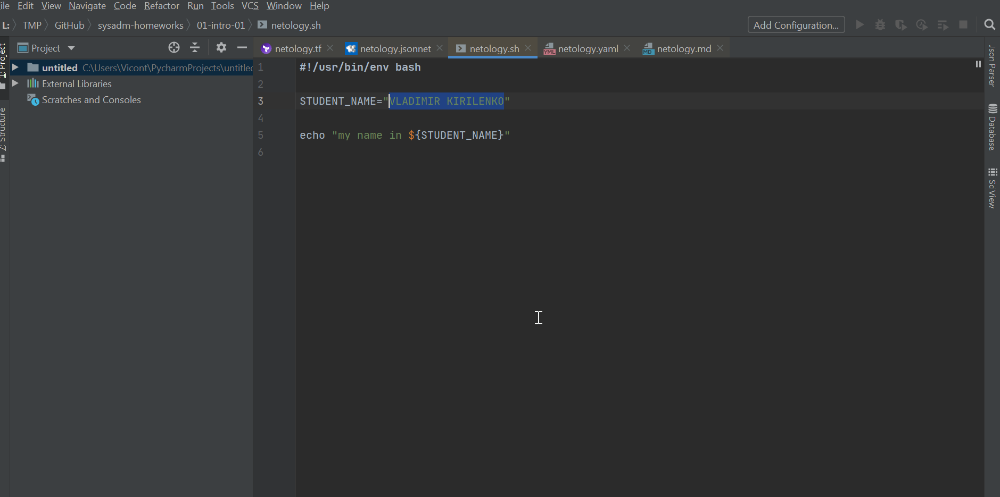
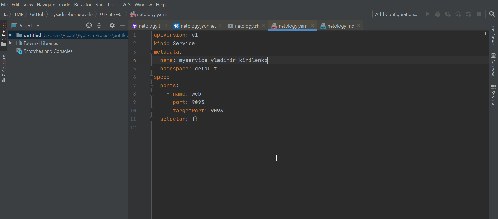

# _Задача 1_

- Terraform screen: 
- JSON screen 
- Markdown screen 
- Bash screen 
- YAML screen 

# _Задача 2_

# Этапы жизненного цикла

### _Участники:_

* _**М** - Менеджер_
* _**Р** - Разработчики_
* _**Т** - Тестировщики_
* _**Д** - Дизайнеры_
* _**А** - Аналитик_
* _**ДО** - DevOps_

## Анализ

1. Сбор требований - **М, А, Р, Д, ДО**
1. Оценка необходимых ресурсов - **М, Р, Д, Т, ДО**
1. Анализ конкурентов - **А, Д**

## Проектирование

1. Описание необходимых процессов - **М, Р, Д, ДО**
1. Разрешение конфликтов требований и ресурсов - **М**
1. Разработка архитектуры - **Р, ДО**
1. Разработка дизайна - **Р, Д**
1. Изменение dataflow - **А**

## Программирование

1. Программирование модулей - **Р**
1. Юнит-тестирование - **Р, Т**
1. Подготовка материалов (текст, медиа) - **Д**
1. Сбор и/или адаптация данных - **А, Р**

## Отладка

1. Сборка - **ДО, Р, Д**
1. Тестирование - **Т**
1. Отладка - **Т, Р, ДО, А**
1. Релиз - **М, Р, Т, Д, А, ДО**

## Сопровождение 

1. Контроль работоспособности - **ДО, М**
1. Исправление ошибок - **Р, Т, А, ДО**
1. Оценка эффективности - **А, М, ДО**
1. Улучшение - **А, Р, Д, Т, ДО**

